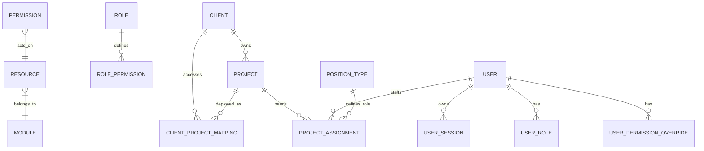

Here is your **Golden Reference**, reformatted and "Over-Engineered" for AI Context Injection.

***

# 🏛️ ReactPortal: System Domain & Architecture Reference

> **CONTEXT INJECTION INSTRUCTION:**
> This document is the **Single Source of Truth** for the ReactPortal project.
> When generating code, architecture decisions, or database schemas, STRICTLY ADHERE to the constraints, relationships, and terminology defined below.
> **Current Stack:** PostgreSQL 18 (UUIDv7), ASP.NET Core (Clean Arch), React (Vite/Zustand/TanStack).

---

## 1. 🔭 High-Level Overview
**ReactPortal** is an enterprise-grade Identity & Resource Allocation platform. It acts as the central nervous system for:
1.  **Identity Management (UAM):** Granular RBAC, SSO integration, and Session handling.
2.  **Portal Gateway:** A routing hub mapping external Clients to specific Project URLs.
3.  **Resource Intelligence:** A visualization engine tracking human resource allocation across 6 distinct technical/functional roles per project.

**Transformation Context:**
*   **From:** Legacy, hardcoded ASP.NET monolith with unscalable permission polling.
*   **To:** Modern, decoupled Clean Architecture.
*   **Primary Directive:** "Normalize, Decouple, Scale."

---

## 🔑 1.1 The SSO Service Broker (Standalone Architecture)

> **CRITICAL ARCHITECTURAL COMPONENT**  
> The application **does not** implement raw OAuth/SAML logic internally for every provider. It delegates this to a standalone **SSO Service Broker**.

- **Role:** A centralized, Multi-Tenant Authentication Gateway.
    
- **Responsibility:**
    
    - It abstracts the complexity of connecting to Azure AD, Google Workspace, Okta, etc.
        
    - It consumes the tenants master table configuration to determine which Identity Provider (IdP) a specific tenant uses.
        
- **The Flow:**
    
    1. **App Request:** ReactPortal redirects user to https://sso-broker.internal/auth?tenant_code=TOYOTA.
        
    2. **Broker Logic:** Broker looks up "TOYOTA", sees it uses "Azure AD", and handles the handshake.
        
    3. **Callback:** Broker returns a standardized AuthToken or SAML Assertion back to ReactPortal.
        
- **Why?** To prevent "SSO Sprawl" where every microservice re-implements auth logic. ReactPortal just trusts the Broker.
    

---

## 2. 🧬 The DNA (Core Modules)

### [[Module 0: Core Foundation]]
*   **Time Strategy:** Server Timezone = `Asia/Kuala_Lumpur`. All DB Timestamps are `TIMESTAMP` (not TZ), handled explicitly.
*   **ID Strategy:** **UUID v7** (Time-Ordered) for all Primary Keys.
    *   *Constraint:* Must use custom `uuid_generate_v7()` function (until PG native support).
    *   *Reason:* Index fragmentation prevention.

### [[Module 1: Access Control & Identity]] (Auth)
**Goal:** Stateless, Secure, Audit-Ready Authentication.
*   **Auth Flow:**
    *   **Credential:** Email + Password (Argon2id or HMAC-SHA512 legacy compat).
    *   **Session Architecture:**
        *   **Frontend:** Stateless. Auth State in Memory (Zustand).
        *   **Backend:** HTTP-Only Secure Cookie (Refresh Token).
        *   **Protocol:** Short-lived JWT Access Token (20m) + Long-lived Refresh Token (60m).
    *   **Silent Refresh:** Axios Interceptors automatically rotate tokens on `401 Unauthorized`.
*   **JWT Validation Strategy:**
    *   **Algorithm:** **RS256 (RSA-SHA256)** - Asymmetric signing.
    *   **Key Discovery:** **OIDC Discovery** - Public keys fetched from SSO Broker's JWKS endpoint.
    *   **Broker Role:** SSO Service Broker holds private key (signer), Portal validates with public key (verifier).
    *   **Configuration:** `Authority` and `Audience` point to SSO Broker. No manual key configuration required.
*   **Lifecycle:**
    *   **Onboarding:** Admin creates User -> System auto-gens password -> Triggers Email.
    *   **Offboarding:** `is_active = FALSE`. (Soft Delete). Hard delete restricted to `user_sessions`.

### [[Module 2: The RBAC Engine]] (Permissions)
**Goal:** Granular, Derived Permissions (Not just simple Roles).
*   **The Hierarchy:** `Module` → `Resource` → `Action` = `Permission`.
*   **The Formula:**
    $$EffectiveAccess = (RolePermissions \cup Override_{Allow}) \setminus Override_{Deny}$$
*   **Entity Mapping:**
    *   **Roles:** Bundles of permissions (e.g., "Project Manager"). **Global scope** (no `tenant_id`).
    *   **UserRoles:** `User` + `Role` (Global assignment, no tenant scoping).
    *   **Overrides:** The "Break-Glass" mechanism. Explicitly grant/deny a permission to a user regardless of role. **Global scope** (no `tenant_id`).
*   **Constraint:** Frontend fetches permissions **ONCE** at bootstrap (Bootstrap Pattern), never polls.

### [[Module 3: Portal Routing]] (Gateway)
**Goal:** M:N Mapping of Clients to Project URLs.
*   **The Trinity:**
    1.  **Client:** The Customer (e.g., "Toyota").
    2.  **Project:** The Software (e.g., "EEngage Core").
    3.  **Mapping:** The Link (`portal_url`).
*   **Logic:**
    *   One `Client` has many `Projects`.
    *   One `Project` serves many `Clients`.
    *   *Critical:* The `portal_url` lives in the **Mapping Table** (`client_project_mappings`), not the Project table, because Toyota's URL for EEngage differs from Honda's.

### [[Module 4: Task Allocation]] (Resource Mgmt)
**Goal:** The "God View" of Staffing.
*   **The Matrix:** A Grid View of `Project` vs `Position`.
*   **The 6 Immutable Positions (Constants):**
    1.  `TECH_PIC` (Technical Lead)
    2.  `TECH_BACKUP`
    3.  `FUNC_PIC` (Functional/Business Lead)
    4.  `FUNC_BACKUP`
    5.  `SUPPORT_PIC` (L1 Support)
    6.  `SUPPORT_BACKUP`
*   **Data Structure:**
    *   `project_assignments` Table: `(project_id, user_id, position_type_id)`.
    *   *Constraint:* A user cannot hold the *exact same position* twice on the same project (Unique Constraint).
*   **Visualization:** Users have a `color_code`. The UI renders "Pills" in the grid cells.

---

## 3. 📐 Data Schema Relationships (ERD Logic)

---

## 4. 🎨 Frontend Architecture (V2 Specifications)

*   **Stack:** React + TypeScript + Vite.
*   **State Management:**
    *   **Global App State:** Zustand (`useAuthStore`, `useNotificationStore`).
    *   **Server State:** TanStack Query (React Query) v5.
*   **UI Components:**
    *   **Design System:** Tailwind CSS + Shadcn/UI.
    *   **Primary Color:** Teal `#3a95a1`.
    *   **Data Grid:** **TanStack Table** (Headless) - *DevExpress has been deprecated.*
    *   **Charts:** **Recharts** (Composable SVG).
*   **Key UX Patterns:**
    *   **Notification Center:** Real-time simulation (Mock Socket) pushing alerts to a Popover.
    *   **Optimistic Updates:** UI updates immediately on "Assign User", reverts on API failure.

---

## 5. ⚡ Critical Business Rules Checklist (The "Do Not Break" List)

1.  **UUID Protocol:** ALL IDs must be generated via the `uuid_generate_v7()` polyfill. Never use `gen_random_uuid()` for PKs.
2.  **Routing Logic:** A `Project` entity is abstract. Users cannot "visit" a project; they visit a `Mapping` (Project + Client Context).
3.  **Security:** Access Tokens are never stored in `localStorage`.
4.  **Audit:** Every write operation (`INSERT`, `UPDATE`, `DELETE`) must have a corresponding entry in `access_audit` or `grant_audit`.
5.  **Vacancy:** A "Vacant" position is simply the absence of a record in `project_assignments` for that specific `(project_id, position_id)` tuple.

---

## 6. 🛠️ API & Database Naming Conventions

*   **Database:** `snake_case` (e.g., `is_active`, `position_type_id`).
*   **API/JSON:** `camelCase` (e.g., `isActive`, `positionTypeId`).
*   **C# Backend:** `PascalCase` (e.g., `IsActive`, `PositionTypeId`).
*   **Legacy Mapping:** If legacy tables exist, they use prefix `mst_` (e.g., `mst_users`), mapped in EF Core `OnModelCreating`.

