# 🏛️ System Architecture: The UAM & Resource Core

> [!WARNING] COMPLEXITY LEVEL: HIGH
> This architecture favors **scalability**, **granularity**, and **traceability** over simplicity. We are building an Enterprise Permissions Engine, not a Todo App.
> **Philosophy:** *Access is derived, not given.*

---

## 🧠 1. The "Big Brain" Mental Model (Data Flow)

We strictly follow a hierarchical inheritance model. The **Security Domain** (Who can do what) is separate from the **Business Domain** (Which Client/Project).

```mermaid
graph TD
    %% Definitions
    subgraph "Layer 0: Genesis"
        M[📦 MODULE]
    end

    subgraph "Layer 1: The Atoms"
        R[🧱 RESOURCE]
        A[⚡ ACTION]
    end

    subgraph "Layer 2: The Molecule"
        P[🔐 PERMISSION]
    end

    subgraph "Layer 3: The Bundle"
        Role[🎓 ROLE]
        RP[🔗 Role_Permissions]
    end

    subgraph "Layer 4: The Identity (Global)"
        U[👤 USER]
        UR[🔗 User_Roles]
    end

    subgraph "Sidecar: Business Scope"
        C[🏭 CLIENT]
        Pr[🚀 PROJECT]
        Map[📍 MAPPING]
    end

    %% Relationships
    M -->|Contains| R
    R -->|Multiplied By| P
    A -->|Multiplied By| P
    P -->|Aggregated Into| RP
    RP -->|Defines| Role
    Role -->|Assigned To| UR
    U -->|Owns| UR
    
    %% Business Links
    C -->|Owns| Pr
    Pr -->|Deployed As| Map
    U -.->|Assigned To| Pr

    %% Logic Notes
    R -.->|Example: Project| P
    A -.->|Example: Edit| P
    P -.->|Result: PROJECT_EDIT| Role
```



---

## 🧱 2. The 4-Layer RBAC Construction

We do not manually create permissions. We **generate** them via cross-multiplication.

### 🔹 Layer 1: Primitives
*   **Modules:** The logical container (e.g., `[[Module - Task Allocation]]`).
*   **Resources:** The entity we are protecting (e.g., `Project`, `User`, `Report`).
*   **Actions:** The verb (e.g., `Create`, `Read`, `Hard_Delete`, `Approve`).

### 🔹 Layer 2: The Cross-Product (Permissions)
$$
Permissions = Resources \times Actions
$$
*   *Example:* `Resource: Project` × `Action: Delete` = `PERMISSION: PROJECT_DELETE`.

### 🔹 Layer 3: Role Definition (Global Bundling)
A **Role** is a named bucket of permissions that applies system-wide.
*   **Correction:** Roles are **NOT** tenant-scoped. They are Global.
*   **Constraint:** A "System Admin" is an Admin for *all* Clients.
*   **Table:** `roles` (No `tenant_id`).

### 🔹 Layer 4: Assignment (User Context)
The moment of truth. We map the `User` to the `Role`.
*   *Table:* `user_roles`
*   *Constraint:* `UNIQUE(user_id, role_id)`
*   *Logic:* User A has the "Manager" role. This grants them capabilities. The *Scope* of those capabilities (which Projects they see) is handled by Data Filtering, not the RBAC table.

---

## 🧮 3. The "Effective Permission" Algorithm

How do we decide if `User A` can do `Action X`? We don't just check roles. We check **Exceptions**.

> [!TIP] The Formula
> The application calculates access dynamically using this logic:

$$
EffectiveAccess = (RolePermissions \cup \color{green}Override_{Allow}) \setminus \color{red}Override_{Deny}
$$

```sql 
-- Pseudo-Code Logic
SELECT permission_code 
FROM user_roles 
JOIN role_permissions ON ...
UNION 
SELECT permission_code FROM overrides WHERE is_allowed = TRUE
EXCEPT 
SELECT permission_code FROM overrides WHERE is_allowed = FALSE
```

### The "Quick Hack" Strategy (User Permission Overrides)
Sometimes, business logic defies structure.
*   **Scenario:** User is "View Only" role but needs to edit *just for today* because the manager is sick.
*   **The Bad Way:** Create a new role `View_Only_Plus_Edit`. (Role Pollution 📉).
*   **The God-Tier Way:** Add a row to `user_permission_overrides` with `is_allowed = TRUE`.
*   **The Negative Override:** User is "Admin" but is banned from `DELETE` actions? Add override `is_allowed = FALSE`.

---

## 🛡️ 4. Security & Authentication (ADR-002)

> [!FAILURE] ANTI-PATTERN: Shared Secrets (HS256)
> We **DO NOT** share secrets between the SSO Broker and the API.

### The Protocol: RSA / JWKS
*   **Mechanism:** Asymmetric Signing (RS256).
*   **Broker:** Holds Private Key (Signer).
*   **API:** Holds Public Key (Verifier) via OIDC Discovery.
*   **Key Storage:** User Secrets (Dev) / Azure Key Vault (Prod).

### The Separation: `user_sessions`
We separate Identity (User) from State (Session).

| Feature | `users` Table | `user_sessions` Table |
| :--- | :--- | :--- |
| **Data Type** | Static Profile (Email, Hash) | Volatile State (Refresh Token, IP) |
| **Lifecycle** | Long-term | Short-term (TTL) |
| **Revocation** | Soft Delete User | Hard Delete / Revoke Token |

---

## 🌐 5. Domain Logic Extensions

### A. Portal Routing (The Hierarchy)
*   **Concept:** `Client` (Parent) ➡️ `Project` (Child) ➡️ `Mapping` (The Link).
*   **The Golden Rule:** A Project is abstract. A **Mapping** (Client + Project) creates the concrete `portal_url`.

### B. Task Allocation (The Flexible Scaling)
*   **Problem:** Today we have "Technical PIC". Tomorrow we need "Scrum Master". We don't want to alter the schema.
*   **Solution:** `position_types` table (Lookup).
*   **Mapping:** `project_assignments` links `User` + `Project` + `PositionType`.
*   **Uniqueness:** `UNIQUE(project_id, user_id, position_type_id)`.
    *   *Correction:* A User cannot hold the *exact same seat* twice.
    *   *Flexibility:* Multiple users *can* hold the same position type (e.g., Two Support PICs are allowed).

---

## 📝 SQL Reference Map

| Logical Concept | Physical Table | Purpose |
| :--- | :--- | :--- |
| **Genesis** | `modules` | The root of all routing/access. |
| **Layer 1** | `resources`, `actions` | The ingredients. |
| **Layer 2** | `permissions` | The product. |
| **Layer 3** | `roles`, `role_permissions` | The global configuration. |
| **Layer 4** | `users`, `user_roles` | The assignment. |
| **Exceptions** | `user_permission_overrides` | The cheat codes. |
| **Business** | `clients`, `projects` | The entities being managed. |
| **Routing** | `client_project_mappings` | The URL generator. |

---

> [!quote] Final Thought
> "We build the system rigid enough to be secure (Global RBAC), but flexible enough (Overrides + Position Lookups) that we don't have to redeploy code when the business changes its mind."