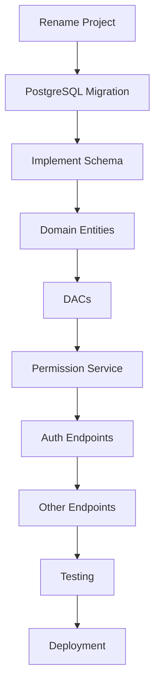

# RGT.Space.API Implementation Roadmap

**Project**: UAM & Resource Portal API  
**Start Date**: 2025-11-26  
**Stack**: ASP.NET 8 + PostgreSQL + Clean Architecture + CQRS  
**Source Template**: MicroservicesBase (POS-oriented multi-tenant template)

> ⚠️ **IMPORTANT IMPLEMENTATION NOTE**: 
> **Tenant Name vs. Code Mapping Gap**: The legacy MSSQL `Tenants` table only has a `Name` column (e.g., "7ELEVEN"). The new UAM schema requires both `name` and `code` (where `code` is used for JWT `tid` and routing). 
> **Decision**: During migration, we will populate `code` using the `Name` value (e.g., Name="7ELEVEN" → Code="7ELEVEN"). This may need refinement later if display names differ from codes.

---

## 📋 **Project Context**

We're building a **User Access Management (UAM) & Resource Portal API** for managing:
1. Multi-tenant RBAC with permission overrides
2. Client-project routing (portal navigation)
3. Task allocation (team resource management)
4. User management with local + SSO authentication

**Key Constraints:**
- ✅ **SSO Broker is separate service** (handles OAuth, already built)
- ✅ **Multi-tenant: Database-per-tenant** (PostgreSQL)
- ✅ **Master DB** pattern with tenant registry
- ✅ **UUID v7** for all IDs
- ✅ **Fluent Results** pattern for API responses
- ✅ **Frontend already expects specific API** (see `READMEs/From-Frontend/1st-request.md`)

**What We Have:**
- 🟢 Robust template with Polly resilience, Serilog, health checks, rate limiting
- 🟢 Clean architecture (API → Core → Infrastructure)
- 🟢 Multi-tenant middleware and connection factory
- 🟢 CQRS with MediatR
- 🔴 Template is for **SQL Server + POS**, we need **PostgreSQL + UAM**

---

## 🎯 **Phase 0: Foundation Setup** (Week 1)

**Goal**: Transform template into UAM project structure

### **Task 0.1: Project Renaming** ✅ CRITICAL
**Time**: 2 hours

- [ ] Rename solution: `MicroservicesBase.sln` → `RgtSpace.sln`
- [ ] Rename projects:
  ```
  MicroservicesBase.API → Rgt.Space.API
  MicroservicesBase.Core → Rgt.Space.Core
  MicroservicesBase.Infrastructure → Rgt.Space.Infrastructure
  MicroservicesBase.Schedulers → Rgt.Space.Schedulers (or delete if not needed)
  ```
- [ ] Update namespaces across all `.cs` files
- [ ] Update project references in `.csproj` files
- [ ] Update `launchSettings.json` (project names)
- [ ] Update Docker Compose, README references
- [ ] Git commit: "Rename to Rgt.Space namespace"

**Tools**: PowerShell script or VS Rename Project extension

---

### **Task 0.2: Database Migration (SQL Server → PostgreSQL)** ✅ CRITICAL
**Time**: 4 hours

**Sub-tasks:**

#### 0.2.1 Update NuGet Packages
- [ ] Remove: `Microsoft.Data.SqlClient`
- [ ] Add: `Npgsql` (latest stable)
- [ ] Add: `Npgsql.EntityFrameworkCore.PostgreSQL` (if using EF migrations)
- [ ] Add: `Dapper` (already present, verify version)

#### 0.2.2 Update Connection String Format
**SQL Server:**
```
Server=localhost;Database=TenantMaster;Trusted_Connection=true;
```

**PostgreSQL:**
```
Host=localhost;Database=tenant_master;Username=postgres;Password=yourpassword;
```

**Files to update:**
- `appsettings.json`
- `appsettings.Development.json`
- `MasterTenantConnectionFactory` (Infrastructure)

#### 0.2.3 Update SQL Syntax
- [ ] Change `UNIQUEIDENTIFIER` → `UUID`
- [ ] Change `NVARCHAR(n)` → `TEXT` or `VARCHAR(n)`
- [ ] Change `BIT` → `BOOLEAN`
- [ ] Change `DATETIMEOFFSET` → `TIMESTAMP WITH TIME ZONE`
- [ ] Change `NEWID()` → `gen_random_uuid()`
- [ ] Change `SYSDATETIMEOFFSET()` → `now()`
- [ ] Update stored procedures (T-SQL → PL/pgSQL)
  - `SET NOCOUNT ON` → remove (not needed)
  - `WITH (NOLOCK)` → remove or use `FOR SHARE SKIP LOCKED`
  - `THROW` → `RAISE EXCEPTION`

**Files affected:**
- `SQL/TenantMaster/*.sql`
- `SQL/TenantDB/*.sql`
- `StoredProcedureNames.cs` (review if PostgreSQL uses functions instead)

#### 0.2.4 Create PostgreSQL Databases
- [ ] Create master DB: `tenant_master`
- [ ] Create auth DB: `rgt_auth_prototype` (for SSO broker integration)
- [ ] Create audit DB: `rgt_auth_audit`
- [ ] Create sample tenant DBs: `7eleven_db`, `rgt_internal_db`

**Migration Scripts:**
- [ ] Create `SQL/PostgreSQL/1-create-master-db.sql`
- [ ] Create `SQL/PostgreSQL/2-create-auth-db.sql` (if needed)
- [ ] Create `SQL/PostgreSQL/3-create-tenant-template.sql`
- [ ] Create `SQL/PostgreSQL/seed-data.sql`

#### 0.2.5 Test Database Connections
- [ ] Create integration test: `Infrastructure.Tests/PostgresConnectionTests.cs`
- [ ] Verify connection pooling works
- [ ] Verify tenant resolution queries work
- [ ] Verify basic CRUD operations work

**Git commit**: "Migrate from SQL Server to PostgreSQL"

---

### **Task 0.3: Implement UAM Schema** ✅ CRITICAL
**Time**: 4 hours

**Reference**: `READMEs/SQL/UAM-schema(latest).md`

#### 0.3.1 Create Master DB Schema
```sql
-- tenant_master database
CREATE TABLE tenants (
    id          BIGINT GENERATED ALWAYS AS IDENTITY PRIMARY KEY,
    name        TEXT NOT NULL,
    code        TEXT NOT NULL UNIQUE,
    connection_string TEXT NOT NULL,
    status      TEXT NOT NULL DEFAULT 'Active',
    -- audit fields
);
```

**Note**: Schema says `BIGINT` but we decided on **UUID**. Update schema doc or use BIGINT?

**Decision needed:** Do we use `BIGINT` or `UUID` for tenant IDs?

#### 0.3.2 Create Tenant DB Schema (per tenant)
- [ ] Implement all tables from `UAM-schema(latest).md`:
  - `users`, `user_sessions`
  - `modules`, `resources`, `actions`, `permissions`
  - `roles`, `role_permissions`, `user_roles`
  - `groups`, `group_members`, `group_roles`
  - `clients`, `projects`, `client_project_mappings` (M:N junction)
  - `position_types`, `project_assignments`
  - `access_audit`, `grant_audit`, `user_permission_overrides`

#### 0.3.3 Create Indexes
- [ ] Copy indexes from schema doc
- [ ] Add composite indexes for permission lookups:
  ```sql
  CREATE INDEX idx_user_roles_lookup ON user_roles (user_id, tenant_id, role_id);
  CREATE INDEX idx_permissions_resource_action ON permissions (resource_id, action_id);
  ```

#### 0.3.4 Seed Reference Data
**Must seed for every tenant:**
- [ ] **Actions**: `VIEW`, `INSERT`, `EDIT` (exactly 3)
- [ ] **Modules**: Portal Routing, Task Allocation, User Maintenance
- [ ] **Resources** (submodules):
  - Portal Routing → Client Navigation, Admin Navigation Console
  - Task Allocation → Member Task Distribution, Summary Allocation
  - User Maintenance → User Account, User Access Rights
- [ ] **Permissions**: 6 resources × 3 actions = 18 permissions
- [ ] **Position Types**: TECH_PIC, TECH_BACKUP, FUNC_PIC, FUNC_BACKUP, SUPPORT_PIC, SUPPORT_BACKUP
- [ ] **Default Admin Role** with all permissions
- [ ] **Default Admin User** (admin@rgtspace.com / Admin@123456789)

**Script**: `SQL/PostgreSQL/seed-reference-data.sql`

**Git commit**: "Implement UAM PostgreSQL schema + seed data"

---

### **Task 0.4: Update Domain Entities** ✅ REQUIRED
**Time**: 3 hours

**Current**: `Sale`, `SaleItem`, `Money` (POS domain)

**New UAM Domain Entities:**

#### 0.4.1 Identity Layer (`Core/Entities/Identity/`)
- [ ] `User.cs` (DisplayName, Email, LocalLoginEnabled, SsoLoginEnabled, PasswordHash, etc.)
- [ ] `UserSession.cs` (RefreshToken, ExpiresAt, DeviceInfo, IsRevoked)
- [ ] `Tenant.cs` (Name, Code, Status)

#### 0.4.2 RBAC Layer (`Core/Entities/Permissions/`)
- [ ] `Module.cs`
- [ ] `Resource.cs`
- [ ] `Action.cs`
- [ ] `Permission.cs`
- [ ] `Role.cs`
- [ ] `UserRole.cs`
- [ ] `RolePermission.cs`
- [ ] `UserPermissionOverride.cs`

#### 0.4.3 Portal Routing (`Core/Entities/PortalRouting/`)
- [ ] `Client.cs`
- [ ] `Project.cs`
- [ ] `ClientProjectMapping.cs` (junction table entity)

#### 0.4.4 Task Allocation (`Core/Entities/TaskAllocation/`)
- [ ] `PositionType.cs`
- [ ] `ProjectAssignment.cs`

**Best Practices:**
- ✅ Use factory methods (`User.Create(...)`)
- ✅ Encapsulation (private setters)
- ✅ Computed properties where applicable
- ✅ Rich domain behavior (not anemic models)

**Files to delete/archive:**
- `Core/Entities/Sale.cs`
- `Core/Entities/SaleItem.cs`
- `Core/Entities/Money.cs` (keep if useful, or delete)

**Git commit**: "Add UAM domain entities"

---

### **Task 0.5: Define Core Abstractions** ✅ REQUIRED
**Time**: 2 hours

Update `Core/Abstractions/` to reflect UAM needs:

#### 0.5.1 Keep from Template
- ✅ `ITenantProvider.cs` (tenant context)
- ✅ `ITenantConnectionFactory.cs` (DB routing)

#### 0.5.2 Remove POS-Specific
- ❌ `ISalesReadDac.cs`

#### 0.5.3 Add UAM Repositories
- [ ] `IUserRepository.cs`
- [ ] `IPermissionRepository.cs` (complex permission calculations)
- [ ] `IClientRepository.cs`
- [ ] `IProjectRepository.cs`
- [ ] `IProjectAssignmentRepository.cs`

**Note**: Repository vs. DAC pattern?
- Template uses **DAC (Data Access Component)** pattern
- Keep DAC for read models (query-heavy)
- Use Repository for write models (command-heavy)

**Git commit**: "Update core abstractions for UAM domain"

---
### **Task 1.2: Tenant Context Middleware Update** ✅ REQUIRED
**Time**: 1 hour

**Update**: `API/Middleware/TenantResolutionMiddleware.cs`

**Add JWT claim support:**
```csharp
// Priority order:
// 1. JWT claim "tid"
// 2. X-Tenant header
// 3. Query param "tenantId"

var tenantCode = context.User.FindFirst("tid")?.Value
    ?? context.Request.Headers["X-Tenant"].FirstOrDefault()
    ?? context.Request.Query["tenantId"].FirstOrDefault();

if (string.IsNullOrEmpty(tenantCode)) {
    await SendError(context, "TENANT_REQUIRED", "Tenant context is required");
    return;
}

// Validate tenant exists (query master DB)
var exists = await _tenantService.TenantExistsAsync(tenantCode);
if (!exists) {
    await SendError(context, "INVALID_TENANT", "Tenant not found");
    return;
}
```

**Git commit**: "Enhanced tenant resolution with JWT claim support"

---

### **Task 1.3: JWT Validation Setup** ✅ CRITICAL
**Time**: 2 hours

**New File**: `API/Configuration/JwtConfiguration.cs`

**Add to `Program.cs`:**
```csharp
services.AddAuthentication(JwtBearerDefaults.AuthenticationScheme)
    .AddJwtBearer(options => {
        options.TokenValidationParameters = new TokenValidationParameters {
            ValidateIssuer = true,
            ValidIssuers = new[] { "https://sso.rgtspace.com", "rgt-space-api" },
            
            ValidateAudience = true,
            ValidAudience = "rgt-space-api",
            
            ValidateIssuerSigningKey = true,
            IssuerSigningKey = new SymmetricSecurityKey(
                Encoding.UTF8.GetBytes(configuration["Jwt:SigningKey"])
            ),
            
            ValidateLifetime = true,
            ClockSkew = TimeSpan.Zero
        };
    });
```

**Update `appsettings.json`:**
```json
{
  "Jwt": {
    "SigningKey": "YOUR-SHARED-SECRET-WITH-SSO-BROKER",
    "Issuer": "rgt-space-api",
    "Audience": "rgt-space-api",
    "AccessTokenLifetimeMinutes": 20
  }
}
```

**Git commit**: "JWT authentication setup (HS256)"

---

### **Task 1.4: Implement Permission Service** ✅ COMPLEX
**Time**: 6 hours

**New Files:**
- `Infrastructure/Services/PermissionService.cs`
- `Core/Abstractions/IPermissionService.cs`

        CancellationToken ct);
    
    // Get permission tree (for /api/v1/auth/permissions endpoint)
    Task<PermissionTreeDto> GetPermissionTreeAsync(
        Guid userId, 
        string tenantCode, 
        CancellationToken ct);
}
```

**Algorithm (from Tech Spec):**
```csharp
// EffectiveAccess = (RolePermissions ∪ OverrideAllow) \ OverrideDeny

var rolePermissions = await GetRolePermissionsAsync(userId, tenantCode);
var allowOverrides = await GetUserOverridesAsync(userId, tenantCode, isAllowed: true);
var denyOverrides = await GetUserOverridesAsync(userId, tenantCode, isAllowed: false);

var effectivePermissions = rolePermissions
    .Union(allowOverrides)
    .Except(denyOverrides);
```

**Performance Considerations:**
- Use Dapper for complex joins
- Cache permission tree per user (IMemoryCache with 5-min TTL)
- Invalidate cache on role/permission changes

**Git commit**: "Implement permission service with override logic"

---

### **Task 1.5: Implement DACs (Data Access Components)** ✅ REQUIRED
**Time**: 8 hours

**Pattern**: Follow template's `SalesReadDac` pattern

**Create DACs:**

#### 1.5.1 User Management DACs
- [ ] `UserReadDac.cs` - Read operations
  - `GetByIdAsync(Guid userId)`
  - `GetAllAsync(tenantCode)`
  - `GetByEmailAsync(string email)`
- [ ] `UserWriteDac.cs` - Write operations
  - `CreateAsync(UserCreateDto)`
  - `UpdateAsync(UserUpdateDto)`
  - `SetStatusAsync(Guid userId, bool isActive)`

#### 1.5.2 Portal Routing DACs
- [ ] `ClientReadDac.cs`
  - `GetAllAsync()`
  - `GetByIdAsync(Guid clientId)`
- [ ] `ProjectReadDac.cs`
  - `GetAllAsync()`
  - `GetByClientIdAsync(Guid clientId)`
- [ ] `ClientProjectMappingReadDac.cs`
  - `GetAllMappingsAsync()` (complex join query)
  - `GetByIdAsync(Guid mappingId)`
- [ ] `ClientProjectMappingWriteDac.cs`
  - `CreateMappingAsync(...)`
  - `UpdateMappingAsync(...)`

#### 1.5.3 Task Allocation DACs
- [ ] `ProjectAssignmentReadDac.cs`
  - `GetAllAssignmentsAsync()` (pivot query: 6 positions → columns)
  - `GetAssignmentSummaryAsync()` (for dashboard charts)
  - `GetVacantPositionSummaryAsync()`
- [ ] `ProjectAssignmentWriteDac.cs`
  - `CreateAssignmentAsync(...)`
  - `UpdatePositionAsync(Guid projectId, string positionType, Guid? userId)`
  - `DeleteAssignmentAsync(Guid projectId)`

**PostgreSQL Specifics:**
- Use `$1, $2` placeholder syntax (not `@param`)
- Or use Dapper's named parameters (works transparently)

**Example Pattern:**
```csharp
public sealed class UserReadDac : IUserReadDac
{
    private readonly ITenantConnectionFactory _connFactory;
    private readonly ITenantProvider _tenant;
    
    public async Task<UserReadModel?> GetByIdAsync(Guid userId, CancellationToken ct)
    {
        var connString = await _connFactory.GetSqlConnectionStringAsync(_tenant.Id, ct);
        
        using var conn = new NpgsqlConnection(connString);
        
        var sql = @"
            SELECT id, display_name, email, contact_number, is_active, created_at
            FROM users
            WHERE id = @UserId AND is_deleted = false";
        
        return await conn.QuerySingleOrDefaultAsync<UserReadModel>(sql, new { UserId = userId });
    }
}
```

**Git commit**: "Implement DACs for all UAM modules"

---

### **Task 1.6: Create Read Models** ✅ REQUIRED
**Time**: 3 hours

**New Folder**: `Core/ReadModels/`

**Create DTOs:**
- [ ] `UserReadModel.cs`
- [ ] `ClientReadModel.cs`
- [ ] `ProjectReadModel.cs`
- [ ] `ProjectMappingReadModel.cs`
- [ ] `ProjectAssignmentReadModel.cs` (denormalized with 6 position fields)
- [ ] `PermissionReadModel.cs`
- [ ] `RoleReadModel.cs`
- [ ] `AssignmentSummaryReadModel.cs` (for dashboard)
- [ ] `VacantPositionSummaryReadModel.cs`

**Pattern:**
```csharp
public sealed record UserReadModel
{
    public Guid Id { get; init; }
    public string DisplayName { get; init; } = string.Empty;
    public string Email { get; init; } = string.Empty;
    public string? ContactNumber { get; init; }
    public bool IsActive { get; init; }
    public Guid RoleId { get; init; }
    public string RoleName { get; init; } = string.Empty;
    public DateTime CreatedAt { get; init; }
    public string? CreatedBy { get; init; }
}
```

**Git commit**: "Add read models for all modules"

---

## 🎯 **Phase 2: API Endpoints (CQRS)** (Week 3-4)

**Goal**: Implement all API endpoints from frontend spec

### **Task 2.1: Authentication Endpoints** ✅ HIGH PRIORITY
**Time**: 6 hours

#### 2.1.1 Local Login
**Endpoint**: `POST /api/v1/auth/login`

**CQRS:**
- [ ] `Infrastructure/Features/Auth/LocalLogin.cs`
  - `Command` record (email, password, tenantCode)
  - `Validator` (FluentValidation)
  - `Handler` (verify password, generate JWT, create session)

**Response Contract**: `Core/Contracts/Auth/LocalLoginResponse.cs`

**Business Logic:**
1. Query user by email + tenant
2. Verify `is_active = true`
3. Verify password hash (use BCrypt or HMAC-SHA512)
4. Check `password_expiry_at`
5. Generate JWT with claims: `sub`, `email`, `name`, `tid`
6. Create `user_sessions` row (local login, not SSO)
7. Return access + refresh tokens

#### 2.1.2 Forgot Password
**Endpoint**: `POST /api/v1/auth/forgot-password`

**CQRS**:
- [ ] `ForgotPassword.cs`

**Logic:**
1. Generate UUID reset token
2. Set `password_reset_token`, `password_reset_expires_at` (15 min TTL)
3. Send email with reset link
4. Always return success (security)

#### 2.1.3 Change Password
**Endpoint**: `POST /api/v1/auth/change-password`

**CQRS:**
- [ ] `ChangePassword.cs`

**Logic:**
1. Validate token not expired
2. Validate password complexity
3. Hash new password
4. Update user
5. Invalidate token
6. Invalidate all `user_sessions` for this user (force re-login)

#### 2.1.4 Get Permissions
**Endpoint**: `GET /api/v1/auth/permissions`

**CQRS:**
- [ ] `GetCurrentUserPermissions.cs`

**Logic:**
1. Get userId from JWT (`sub` claim)
2. Call `PermissionService.GetPermissionTreeAsync()`
3. Map to nested DTO (module → submodules → canView/canInsert/canEdit)

**Git commit**: "Implement authentication endpoints"

---

### **Task 2.2: Dashboard Endpoints** ✅ MEDIUM PRIORITY
**Time**: 3 hours

#### 2.2.1 Assignment Summary
**Endpoint**: `GET /api/v1/dashboard/assignment-summary`

**CQRS:**
- [ ] `GetAssignmentSummary.cs`

**Query:**
```sql
SELECT 
    u.display_name AS member_name,
    u.color_code,
    COUNT(CASE WHEN pt.code = 'TECH_PIC' THEN 1 END) AS technical_pic,
    COUNT(CASE WHEN pt.code = 'TECH_BACKUP' THEN 1 END) AS technical_backup,
    -- ... other 4 positions
FROM project_assignments pa
JOIN users u ON pa.user_id = u.id
JOIN position_types pt ON pa.position_type_id = pt.id
GROUP BY u.id, u.display_name, u.color_code
ORDER BY u.display_name;
```

#### 2.2.2 Vacant Positions
**Endpoint**: `GET /api/v1/dashboard/vacant-positions`

**CQRS:**
- [ ] `GetVacantPositionSummary.cs`

**Query Logic:**
```sql
-- Count projects with no assignment for each position type
SELECT
    COUNT(DISTINCT p.id) FILTER (WHERE TECH_PIC IS NULL) AS technical_pic,
    COUNT(DISTINCT p.id) FILTER (WHERE TECH_BACKUP IS NULL) AS technical_backup,
    -- ... other 4 positions
FROM projects p
LEFT JOIN project_assignments pa ON p.id = pa.project_id;
```

**Git commit**: "Implement dashboard endpoints"

---

### **Task 2.3: Portal Routing Endpoints** ✅ MEDIUM PRIORITY
**Time**: 8 hours

**Endpoints to implement:**
1. `GET /api/v1/portal-routing/clients` → `GetAllClients.cs`
2. `GET /api/v1/portal-routing/clients/{clientId}/projects` → `GetProjectsByClient.cs`
3. `GET /api/v1/portal-routing/admin/mappings` → `GetAdminMappings.cs`
4. `GET /api/v1/portal-routing/admin/mappings/{id}` → `GetMappingById.cs`
5. `POST /api/v1/portal-routing/admin/mappings` → `CreateMapping.cs`
6. `PUT /api/v1/portal-routing/admin/mappings/{id}` → `UpdateMapping.cs`
7. `GET /api/v1/portal-routing/projects` → `GetAllProjects.cs`
8. `POST /api/v1/portal-routing/projects` → `CreateProject.cs`

**Key Implementation Notes:**
- Mappings return data from junction table `client_project_mappings`
- Validate client/project exist before creating mapping
- Check unique constraint: (tenant_id, client_id, project_id)

**Git commit**: "Implement portal routing endpoints"

---

### **Task 2.4: Task Allocation Endpoints** ✅ HIGH COMPLEXITY
**Time**: 10 hours

**Endpoints:**
1. `GET /api/v1/task-allocation/project-mappings` → `GetAllProjectAssignments.cs`
2. `GET /api/v1/task-allocation/team-members` → `GetTeamMembers.cs`
3. `GET /api/v1/task-allocation/team-member-colors` → `GetTeamMemberColors.cs`
4. `POST /api/v1/task-allocation/team-member-colors` → `AddTeamMemberColor.cs`
5. `POST /api/v1/task-allocation/assignments` → `CreateProjectAssignment.cs`
6. `PUT /api/v1/task-allocation/assignments/{projectId}/positions/{positionType}` → `UpdatePosition.cs`
7. `DELETE /api/v1/task-allocation/project-mappings/{mappingId}` → `DeleteAssignment.cs`

**Complex Logic:**

#### Pivot Query (project_assignments → 6 columns)
```sql
SELECT 
    p.id AS project_id,
    p.name AS project_name,
    c.id AS client_id,
    c.name AS client_name,
    
    MAX(CASE WHEN pt.code = 'TECH_PIC' THEN pa.user_id END) AS technical_pic_id,
    MAX(CASE WHEN pt.code = 'TECH_PIC' THEN u.display_name END) AS technical_pic_name,
    
    -- Repeat for other 5 positions...
    
FROM projects p
LEFT JOIN client_project_mappings cpm ON p.id = cpm.project_id
LEFT JOIN clients c ON cpm.client_id = c.id
LEFT JOIN project_assignments pa ON p.id = pa.project_id
LEFT JOIN position_types pt ON pa.position_type_id = pt.id
LEFT JOIN users u ON pa.user_id = u.id
GROUP BY p.id, p.name, c.id, c.name;
```

#### Update Position Logic
```csharp
// If userId is null: DELETE assignment
// If userId is not null + assignment exists: UPDATE user_id
// If userId is not null + no assignment: INSERT new row
```

**Git commit**: "Implement task allocation endpoints"

---

### **Task 2.5: User Management Endpoints** ✅ HIGH PRIORITY
**Time**: 12 hours

**Endpoints:**

#### User CRUD
1. `GET /api/v1/user-management/users` → `GetAllUsers.cs`
2. `GET /api/v1/user-management/users/{id}` → `GetUserById.cs`
3. `POST /api/v1/user-management/users` → `CreateUser.cs`
4. `PUT /api/v1/user-management/users/{id}` → `UpdateUser.cs`
5. `GET /api/v1/user-management/roles` → `GetRoles.cs`

#### User Access Rights
6. `GET /api/v1/user-management/access-rights/users` → `GetUsersForAccessRights.cs`
7. `GET /api/v1/user-management/access-rights/modules` → `GetPermissionModules.cs`
8. `GET /api/v1/user-management/access-rights/users/{userId}/permissions` → `GetUserPermissions.cs`
9. `PUT /api/v1/user-management/access-rights/users/{userId}/permissions` → `UpdateUserPermissions.cs`

**Complex Logic:**

#### CreateUser
1. Validate email unique
2. Generate random password (12 chars)
3. Hash password
4. Set `password_expiry_at` (e.g., 30 days)
5. Send email with credentials
6. Return user object

#### UpdateUserPermissions
1. Validate permission hierarchy: `canEdit` requires `canView`
2. Upsert into `user_permission_overrides` table
3. Clear cache for this user's permissions
4. Return updated count
| **Phase 3: Testing** | Week 5 | Unit + Integration + Load tests |
| **Phase 4: Deployment** | Week 6 | Documentation, Docker, deployment scripts |

**Total**: 6 weeks (with buffer)

---

## 🚨 **Critical Path Dependencies**



---

## ✅ **Next Immediate Actions**

**Today (2025-11-26):**
1. ✅ Confirm ID type: `BIGINT` or `UUID`? (we said UUID v7)
2. ✅ Create this roadmap document
3. ✅ Start Task 0.1: Rename projects

**Tomorrow:**
4. ✅ Task 0.2: PostgreSQL migration
5. ✅ Task 0.3: Implement UAM schema

---

## 📋 **Decision Log**

| Date | Decision | Rationale |
|------|----------|-----------|
| 2025-11-26 | Use PostgreSQL | Client requirement, SSO broker already uses it |
| 2025-11-26 | Use UUID v7 for IDs | Time-ordered, globally unique, distributed-safe |
| 2025-11-26 | Keep Fluent Results | Frontend already expects this pattern |
| 2025-11-26 | OAuth via SSO Broker | Decoupled authentication, reusable service |
| 2025-11-26 | M:N client-project relationship | Business requirement: 1 project, multiple clients, different URLs |

---

## 🔗 **Reference Documents**

- Frontend API Spec: `READMEs/From-Frontend/1st-request.md`
- Database Schema: `READMEs/SQL/UAM-schema(latest).md`
- Technical Spec: `READMEs/SQL/UAM-TechnicalSpecExplained.md`
- Architecture Clarification: `READMEs/To-Frontend/architecture-clarification-for-frontend.md`

---

## 🙋 **Questions to Resolve**

- [ ] **ID Type**: Schema doc says `BIGINT`, we agreed on `UUID`. Which do we use?
- [ ] **Tenant ID in JWT**: Should tenant ID be UUID or string code?
- [ ] **User color assignment**: Is this a separate table or a column in `users`?
- [ ] **Position types**: Should this be reference data (seeded) or user-managed?

---

**Let's start with Task 0.1: Project Renaming! 🚀**
