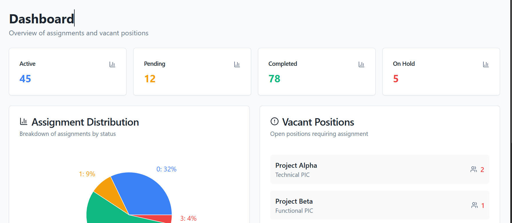

# Phase 3: Dashboard Aggregates Implementation Plan

**Goal:** Power the Dashboard screen with instant statistics and charts.

## 1. Architecture
We will create a new **Dashboard** feature slice to handle data aggregation.
This module will read from both `PortalRouting` (Projects) and `TaskAllocation` (Assignments) tables.

### 1.1 New Files
*   `Rgt.Space.Core/Abstractions/Dashboard/IDashboardReadDac.cs`
*   `Rgt.Space.Infrastructure/Persistence/Dac/Dashboard/DashboardReadDac.cs`
*   `Rgt.Space.API/Endpoints/Dashboard/GetStats/Endpoint.cs`
*   `Rgt.Space.Core/Domain/Contracts/Dashboard/DashboardStatsResponse.cs`

## 2. Data Logic
### 2.1 Metrics (KPI Cards)
1.  **Active Assignments**:
    *   `SELECT COUNT(*) FROM "TaskAllocation".project_assignments WHERE deleted_at IS NULL`
2.  **Pending Vacancies**:
    *   *Definition:* Total required positions minus filled positions.
    *   *Logic:* `(Count(ActiveProjects) * 3) - Count(Assignments where Position in ('TECH_PIC', 'FUNC_PIC', 'SUPPORT_PIC'))`
3.  **Completed Projects**:
    *   `SELECT COUNT(*) FROM "PortalRouting".client_project_mappings WHERE status = 'Completed' AND deleted_at IS NULL`
4.  **On Hold Projects**:
    *   `SELECT COUNT(*) FROM "PortalRouting".client_project_mappings WHERE status = 'OnHold' AND deleted_at IS NULL`

### 2.2 Charts & Lists
5.  **Assignment Distribution (Pie Chart)**:
    *   Breakdown of assignments by `PositionCode` (or Status if applicable).
    *   `SELECT position_code, COUNT(*) FROM "TaskAllocation".project_assignments WHERE deleted_at IS NULL GROUP BY position_code`
6.  **Vacant Positions (List)**:
    *   *Goal:* Show top 5 projects with missing mandatory roles.
    *   *Logic:* 
        *   Fetch all Active Projects.
        *   Fetch all Assignments for these projects.
        *   In-memory: Identify projects missing `TECH_PIC`, `FUNC_PIC`, or `SUPPORT_PIC`.
        *   Return list of `{ ProjectName, MissingRole }`.

## 3. Implementation Steps
1.  **Contracts**: Define `DashboardStatsResponse`.
2.  **DAC Interface**: Define `IDashboardReadDac`.
3.  **DAC Implementation**: Implement SQL queries using Dapper.
4.  **Endpoint**: Wire up the endpoint to the DAC.
5.  **DI Registration**: Register the new DAC in `Extensions.cs`.

## 4. Verification
*   Call `GET /api/v1/dashboard/stats`.
*   Verify the numbers match the database state.
